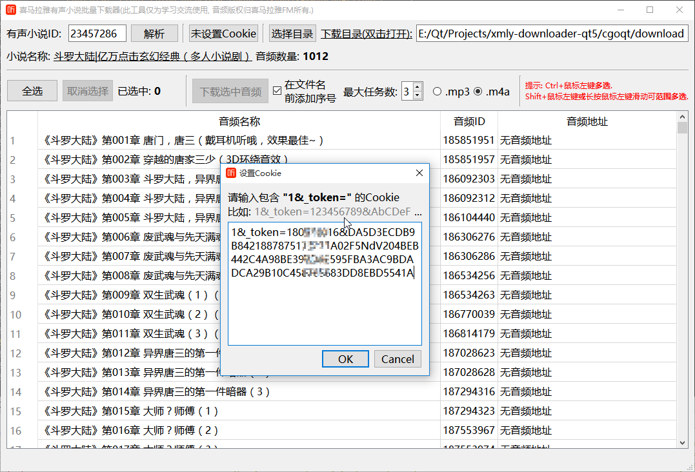
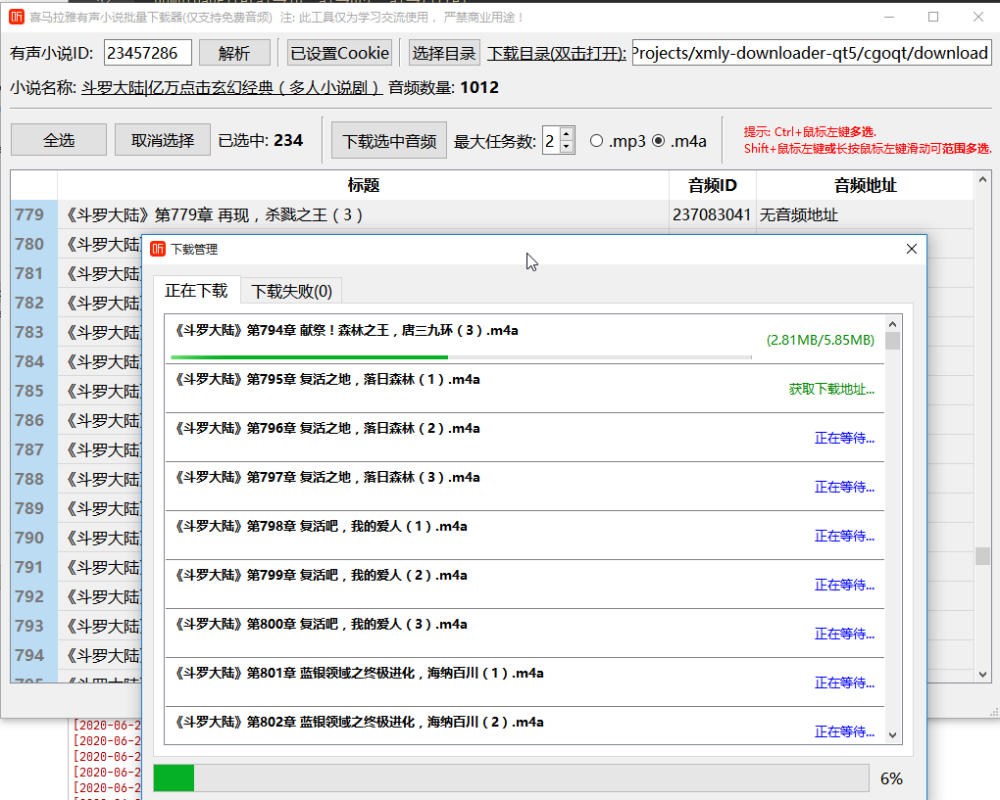

<h1 align="center">- 喜马拉雅FM下载器 GUI -</h1>

  
  
  
   
  

喜马拉雅FM有声书专辑下载器. 使用Go+Qt5编写(非Qt binding).

> 本项目的目的在于学习Go+Qt在跨平台的GUI应用，如需进行其他用途使用，请遵照许可协议Fork，使用本软件所造成的一切后果与本人无关。

> Golang API: https://github.com/jing332/xmlydownloader

# 预览

