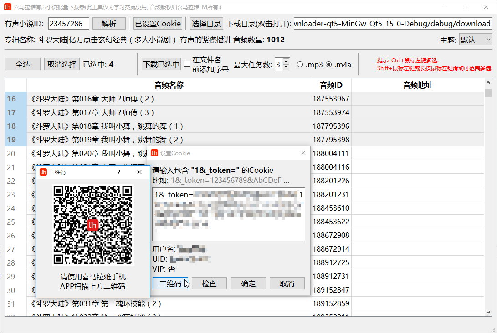
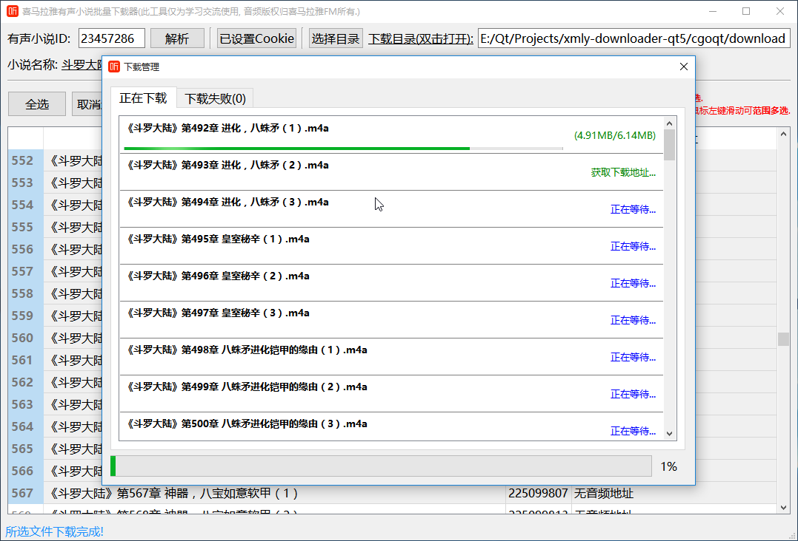
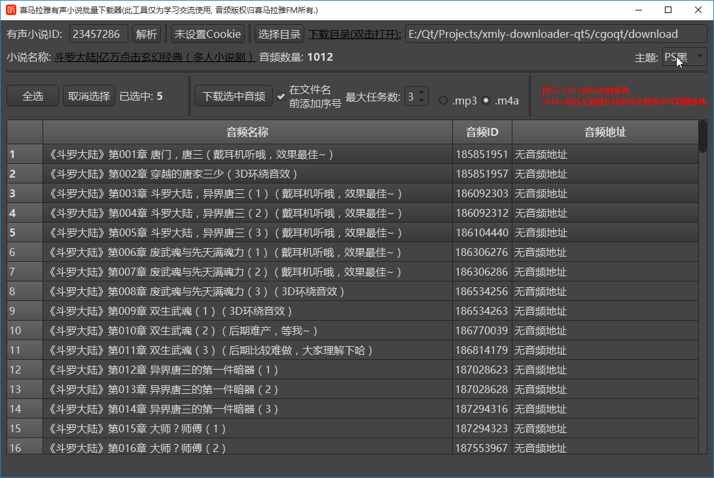
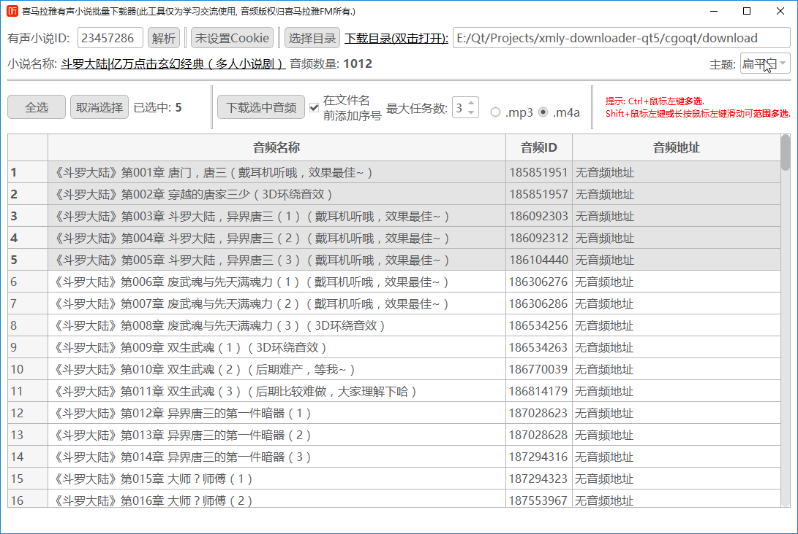

<h1 align="center">- 喜马拉雅FM下载器 GUI -</h1>

  
  
  
   
  <a href="https://github.com/jing332/xmly-downloader-qt5/actions"><a/>
   
  

喜马拉雅FM有声书专辑下载器. 使用Go+Qt5编写(非Qt binding).

> 本项目的目的在于学习Go+Qt在跨平台的GUI应用，如需进行其他用途使用，请遵照许可协议Fork，使用本软件所造成的一切后果与本人无关。

> Golang API: https://github.com/jing332/xmlydownloader

# Screenshots

展开查看

  

# Build

> 如需静态编译本项目, 请参考 [ci/appveyor_build.ps1](https://github.com/jing332/xmly-downloader-qt5/blob/master/ci/appveyor_build.ps1) 或 [.github/workflows/build_qmake.yml](https://github.com/jing332/xmly-downloader-qt5/blob/master/.github/workflows/build_qmake.yml)

### 开发环境
`Qt 5.12+`  
`Go 1.13+`

1. 将 `Qt安装目录\Qt版本号\mingwXX_64\bin` 加入到系统PATH变量, 使用命令 `gcc -v` 测试是否生效.  
2. 使用命令 `git clone https://github.com/jing332/xmly-downloader-qt5` 将项目克隆到本地.  
3. 进入 `/src/cgoqt` 文件夹, 使用命令 `go build -buildmode=c-archive -o xmlydownloader.a` 生成C静态库.  
4. 最后, 打开 `Qt Creator` 导入 `/src/xmly-downloader-qt5.pro` 即可编译运行.  
